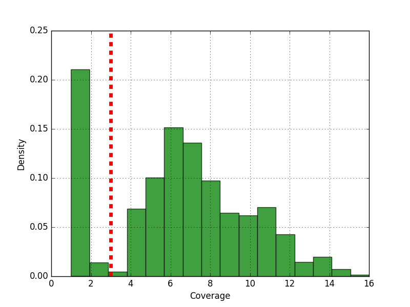
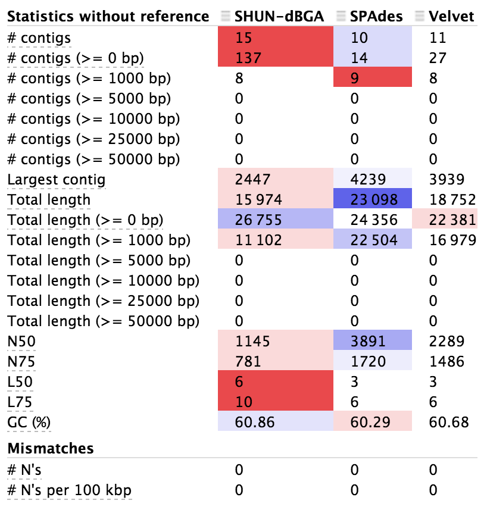
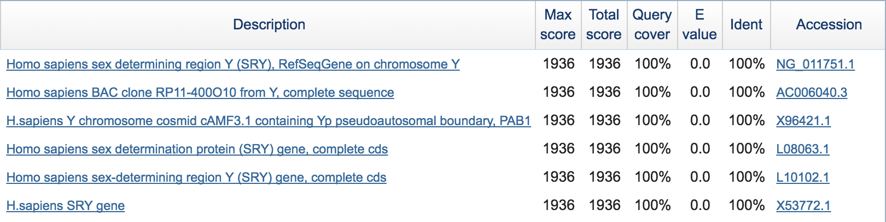
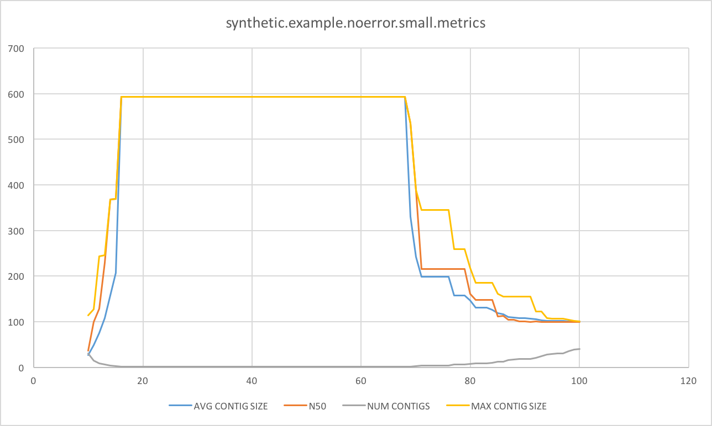
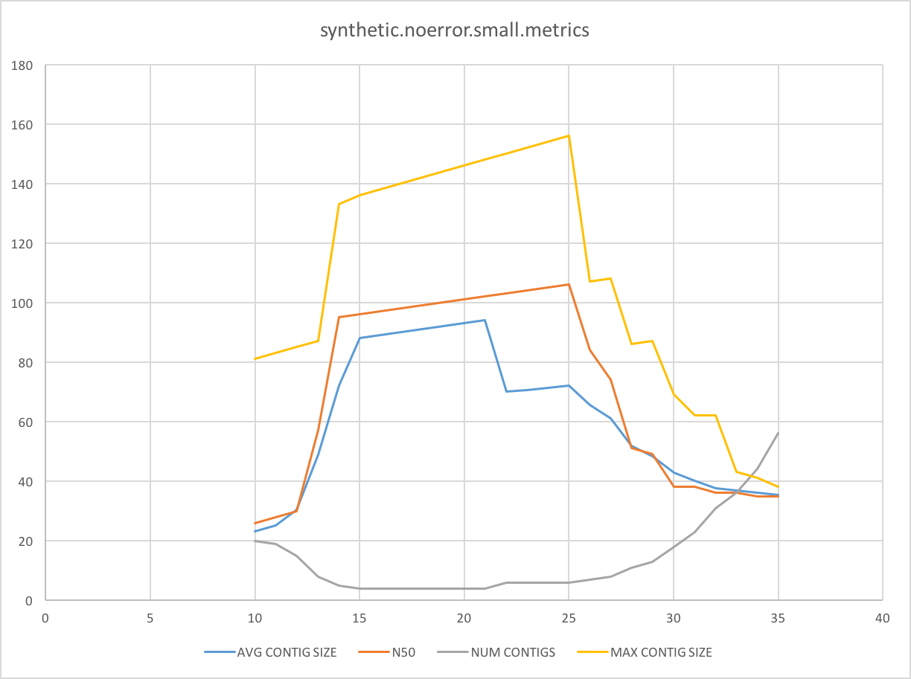
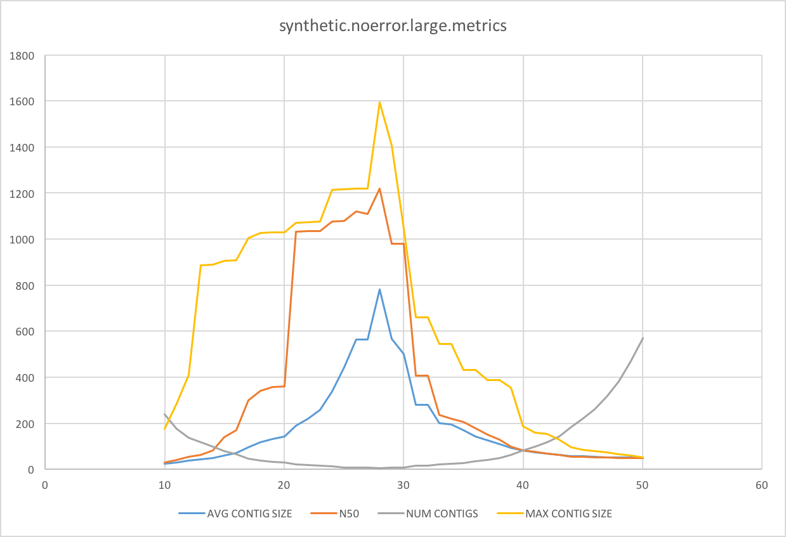
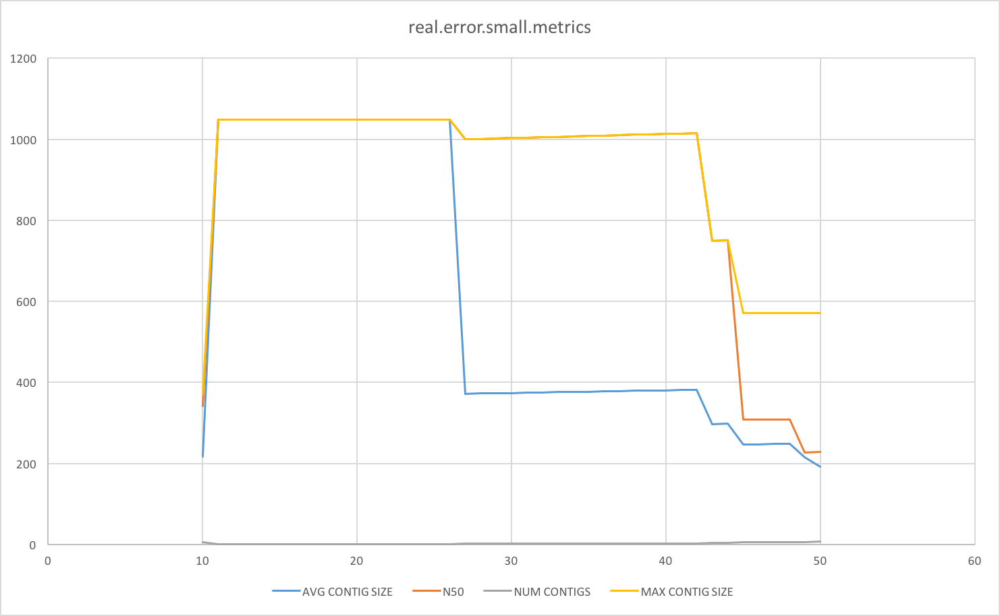
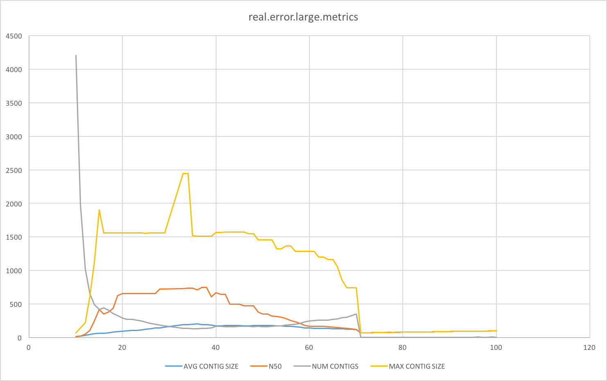

# de Bruijn Graph Assembler Project

By Caleb Cranney, Lucas Pinto, Shun Sambongi

## Table of Contents

[toc]

## Method used for handling errors

We analyzed kmer frequencies to handle errors. If the input file had errors in it we calculated kmer frequencies and created a graph like the following:



Then we calculated the first local minimum (shown by the red dotted line) and removed all kmers that had coverage less than the minimum value. 

This method for error handling seems to work decently.  Comparing the results obtained from the ```real.error.small.fasta``` dataset first without error handling and then with error handling, we obtained the following results:

Error Handling | k | Avg. Contig Size | N50 | Num. Contigs | Max Contig Size
:-: | :-: | :-: | :-: | :-: | :-: | :-:
No | 20 | 50.02 | 45 | 42 | 180
Yes | 20 | 1048 | 1048 | 1 | 1048

From this comparison, we saw that the results drastically improved with our method of error handling.

## Method used for bridging branching nodes

We did not implement a method for bridging branching nodes

## Analysis of the quality of assemblies

We found that the qualities of our assemblies were fair. We analyzed the quality of our assemblies by 1) checking our obtained metrics, 2) comparing our assembled contigs with contigs from other assemblers, and 3) analyzing BLAST results for our assembled contig.

### Metrics

From the metrics we obtained from our assembler (average contig size, N50, number of contigs, max contig size), we were fairly confident in the quality of our assemblies. For four out of the five datasets, the assembler generated under ten total contigs. The ```real.error.small.fasta``` dataset actually gave us only one contig which suggested that error handling was also working well to give us higher-quality assemblies.

The one concern with the metrics was with the ```real.error.large.fasta``` dataset. Because the dataset was much larger than all of the other datasets and because it contained errors, the quality of the assembly did not seem as high when looking at the metrics (a much larger number of contigs). This, however, could be normal with larger datasets.

### Comparison with other assemblers

After comparing our generated contigs for ```real.error.large.fasta``` with other assemblers, it was obvious that the quality of our assemblies was not as high as the others. Out of the three assemblers we compared (including ours), we had the worst scores for most of the metrics.

### BLAST results

For the real datasets ```real.error.small.fasta``` and ```real.error.large.fasta```, we used BLAST to see where our generated contigs could be found. In both cases, BLAST was able to find locations in the human genome where our contigs gave a 100% match. If we could verify the BLAST results, that would suggest that the quality of our assemblies is "good enough" depending on what the assembly is for.

## Comparison to other assemblers

### QUAST

We compared our assembly results with the SPAdes and Velvet assemblers. Since SPAdes was only able to run using the ```real.error.large.fasta``` dataset, we only compared the the results from this dataset. We used [QUAST](http://quast.bioinf.spbau.ru/) to compare our results.

>All statistics are based on contigs of size >= 500 bp, unless otherwise noted (e.g., "# contigs (>= 0 bp)" and "Total length (>= 0 bp)" include all contigs).





>Contigs are ordered from largest (contig #1) to smallest.


>Contigs are broken into nonoverlapping 100 bp windows. Plot shows numbers of windows for each GC percentage.

From the results we got from QUAST, it was easy to see that SPAdes and Velvet both did much better than our assembler (which was not a surprise). Although, SPAdes did better than Velvet, it could be due to the parameters that were used when running Velvet. 

## BLAST results

### real.error.small.fasta

It is likely that the reads in this dataset came from the section of the Y chromosome encoding the sex-determining region Y (SRY) gene. Most of the top BLAST results refer to the SRY gene and all of them refer to the Y chromosome. All of the top results also have an Expect (E) value of 0.0, so we assumed that the match must be significant. The top BLAST results for the contigs from the ```real.error.small.fasta``` dataset can be seen below.



### real.error.large.fasta

It is likely that the reads in this dataset came from the region encoding the ABCA7 gene on chromosome 19. Again, similar to the smaller real dataset, both of our top BLAST results refer to a genomic region on chromosome 19. They each have E values of 0.0 as well so we assumed that our match was significant. The top BLAST results for the contigs from the ```real.error.large.fasta``` dataset can be seen below.


For both the small and large datasets, all of the top BLAST results were for *Homo sapiens*. This supported that our assembler was working correctly because we knew beforehand that the real datasets came from the human genome.

## Kmer size that gave the best assembly for each dataset

### Overview

For each dataset, we ran our assembler for values of k = 10 through k = n, where n is equal to the length of reads in the dataset. We then calculated metrics (average contig size, N50, number of contigs, and max contig size) for the assemblies and selected the best value of k for each dataset by finding which values give us the best metrics. The following table shows the best value of k and the metrics from that value for each dataset.

Dataset |  k  | Avg. Contig Size | N50 | Num. Contigs | Max Contig Size
------- | :-: | :--------------: | :-: | :----------: | :-------------:
synthetic.example.noerror.small.fasta | 16-68 | 593 | 593 | 1 | 593
synthetic.noerror.small.fasta | 25 | 72 | 106 | 6 | 156
synthetic.noerror.large.fasta | 28 | 781.4 | 1220 | 5 | 1593
real.error.small.fasta | 11-26 | 1048 | 1048 | 1 | 1048
real.error.large.fasta | 34 | 195.29 | 734 | 137 | 2447

### synthetic.example.noerror.small.fasta

For this dataset, the values of k = 16 through k = 68 gave us the best results



### synthetic.noerror.small.fasta

For this dataset, the value of k = 25 gave us the best results



### synthetic.noerror.large.fasta

For this dataset, the value of k = 28 gave us the best results



### real.error.small.fasta

For this dataset, the values of k = 11 through k = 26 gave us the best results



### real.error.large.fasta

For this dataset, the value of k = 34 gave us the best results



There was some difficulty in selecting the best value for k for each dataset was because some values of k scored better in certain metrics while others values scored better in other metrics. We made a "best guess" where the overall score for all metrics seemed the best. A computational method would be better. We also should consider some metrics being more "weighted" which could slightly change the best value of k.

## Ideas on how the assembler might be improved

* Our approach for error handling is a bit naive. A more statistical method seems better. Velvet's approach in letting the user manually choose the coverage cutoff could also be another option. 
* Depending on the dataset and the value of k, the generated de Bruijn graph seemed to put the script into an infinite loop. For example, with the ```real.error.large.fasta``` dataset and a value of k = 30, the generated de Bruijn graph was not strongly connected and the script could not assemble anything or output any results. A different method of error handling or a way to resolve each strongly connected component in the graph could improve the assembler.
* For our project, we assumed that all reads were in the forward direction. However it could be possible that reads could be in the reverse direction as well. Our assembler could be improved by considering reverse complements of reads in addition to forward reads.

## Recommendations for improving this project for next semester

* There should be more guidance in how to do error handling. We never really spent much time learning about different ways to handle errors except for one day in class. If we had some sort of assignment (like a Rosalind problem) before the lab to understand error handling, it would have helped a lot.
* It would have also helped if there were some resources to help understand how to evaluate the metrics. For example, it would be helpful to know which metrics matter more.